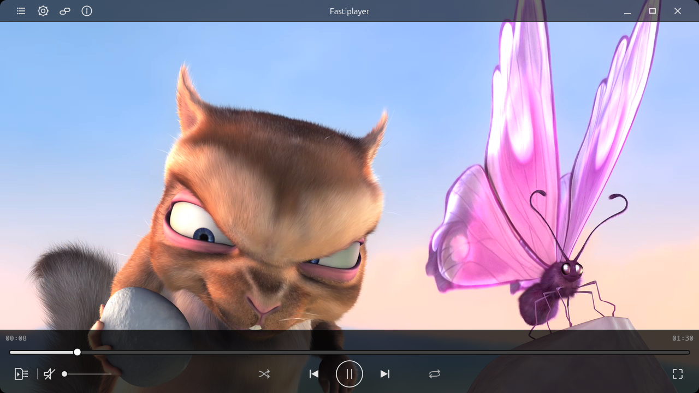

<p align="center">
  
</p>

# Fastiplayer

An open media player built around a simple ambition: **lightweight, beautiful, responsive playback, with the controls you need close at hand.**

**Early alpha · Active development · Linux-first · Source builds**

Fastiplayer already plays local and network media. The everyday experience is still taking shape: expect rough edges, incomplete compatibility, and a mix of English and Russian in the interface. Build from source to try it today.

**[See it in action](#see-it-in-action) · [Build and run](#quick-start) · [Roadmap to 1.0](#roadmap-to-10) · [Vision](docs/vision.md)**

[](https://github.com/Bogdan7c/fastiplayer/actions/workflows/ci.yml)
[](https://github.com/Bogdan7c/fastiplayer/actions/workflows/toolchain-policy.yml)
[](LICENSE)

## See it in action

[](docs/demo.md)

**[Download the 39-second demo → (MP4, 5.3 MB)](https://github.com/Bogdan7c/fastiplayer/raw/refs/heads/main/docs/assets/fastiplayer-demo.mp4)** — open a local file, play, pause, resume, seek, and explore the queue and settings.

Download the MP4 and open it in your player; GitHub does not provide an inline preview for this file. These are real application captures from the current development computer, with English captions in the demo. Movie imagery: © 2008 Blender Foundation, CC BY 3.0. See [more screenshots](docs/demo.md) and [media attribution and capture details](docs/assets/README.md). These captures are separate from the historical ThinkPad T480s measurements.

## What guides the project

- **Lightness.** Keep resource use deliberate, with bounded work and measured optimization. Low overhead is a development priority; published results show both gains and remaining costs.
- **Beauty.** Give playback room to breathe, with a coherent interface and attention to small details. Completing that design across the application is ongoing work.
- **Responsiveness.** Make play, pause, seeking, and navigation feel immediate. Diagnose delays at the point where the user sees or hears the result.
- **Control.** Put useful choices within reach, from queue navigation to runtime settings. Broader appearance customization is planned.
- **Depth that serves everyday use.** Bring local files, network sources, playlists, and capable media processing together in one understandable player.

Read the [vision](docs/vision.md) for the longer view and the multimedia architecture behind it.

## What works today

- **Local video and audio**, playback controls, seeking, and stream selection within supported media profiles. Video uses VA-API hardware decoding where supported, or FFmpeg software decoding, with WGPU/Vulkan rendering.
- **Network playback:** native progressive HTTP(S)/FTP(S), HLS and DASH VOD/live/DVR, and supported static Smooth Streaming and HDS profiles. Web-page extraction can use optional system `yt-dlp`.
- **A persistent queue:** M3U/M3U8, XSPF, and CUE import/export, queue navigation, and playback-position restore. [See the queue](docs/demo.md#queue).
- **Runtime settings**, live previews where supported, and controlled Apply/rollback. Some changes rebuild the affected playback component; busy operations can require a retry. [See settings](docs/demo.md#settings).
- **GPU HDR-to-SDR tone mapping**, including verified AV1 10-bit P010 input on the SDR output path.

The [media compatibility matrix](docs/web-media-compatibility-matrix.md) defines the accepted container, codec, and protocol profiles. A format or protocol name does not promise every variant.

## Current limitations

- Linux is the current application platform. Windows is planned before 1.0; macOS is a possible later direction without a delivery commitment. There are source builds, with no ready-to-install application packages in the current release.
- A working Vulkan GPU/driver is required even for software video decoding. Hardware acceleration depends on the device, driver, codec, and frame profile; a CPU readback fallback is not implemented.
- Native HDR display output and subtitle playback are not implemented. Subtitle descriptors in a manifest do not imply playable subtitles.
- The interface is unfinished and partly Russian. Cohesive redesign, localization, and fuller appearance customization remain roadmap work.
- DRM, RTSP/RTP/MMS, RTMP wire playback, and private live extractor state are outside the supported profile. Smooth Streaming and HDS support static VOD only. Web-page extraction also depends on compatible `yt-dlp` extractors and service availability.

See the [compatibility matrix](docs/web-media-compatibility-matrix.md) and [recorded acceptance limitations](docs/native-web-ingress-n15-acceptance.md#known-limitations) for exact exclusions and the scope of the tests.

## Quick start


Build prerequisites: Linux x86_64, a Vulkan-capable GPU/driver, Rust **1.96.0** from [rust-toolchain.toml](rust-toolchain.toml), a C/C++ toolchain, `clang`/`libclang`, `pkg-config`, and development headers for ALSA, FFmpeg, GBM/DRM, and VA-API. The locked MSRV check uses Rust **1.92.0**.

Ubuntu 24.04 package names, aligned with the repository's CI prerequisites:

```bash
sudo apt-get update
sudo apt-get install build-essential clang libclang-dev pkg-config \
  libasound2-dev libavcodec-dev libavutil-dev libdrm-dev libgbm-dev libva-dev \
  libvulkan1 mesa-vulkan-drivers

git clone https://github.com/Bogdan7c/fastiplayer.git
cd fastiplayer
cargo build -p app-egui --release --locked
./target/release/fastiplayer /path/to/media.mp4
```

Install Rust through rustup before building; the repository pins the toolchain. Mesa packages above do not replace the correct VA-API driver for your GPU. Supply your own local media file and run in a graphical desktop session with access to the render device and audio output.

For web-page extraction, install system `yt-dlp` separately. The repository's accepted extractor profile uses **2026.07.04**; other versions are not automatically acceptance-qualified. Supported native direct sources do not require it. See the [web-media matrix](docs/web-media-compatibility-matrix.md).

The default application feature includes FFmpeg software decoding. The build boundary without it is checked with:

```bash
cargo check -p app-egui --no-default-features --locked
```

## Roadmap to 1.0

The next major capability is a native Rust subtitle engine. The planned sequence then develops browser handoff, the interface, customization, localization, older-hardware rendering, drag-and-drop, and Windows support. These are future capabilities, not features included in the alpha.


The implementation order is fixed in [milestone 1.0](https://github.com/Bogdan7c/fastiplayer/milestone/1); these are planned capabilities:

1. [Build a native Rust subtitle engine with a broad, published text/styled/bitmap format compatibility matrix.](https://github.com/Bogdan7c/fastiplayer/issues/1)
2. [Add a browser media-handoff bridge and browser extension.](https://github.com/Bogdan7c/fastiplayer/issues/2)
3. [Complete the cohesive application redesign, including replacement of the prototype settings UI.](https://github.com/Bogdan7c/fastiplayer/issues/3)
4. [Make application colors and appearance fully configurable from settings.](https://github.com/Bogdan7c/fastiplayer/issues/4)
5. [Add localization infrastructure and initial translations.](https://github.com/Bogdan7c/fastiplayer/issues/5)
6. [Add an OpenGL ES 2.0 renderer for older Linux hardware.](https://github.com/Bogdan7c/fastiplayer/issues/6)
7. [Add drag-and-drop for local files and URLs.](https://github.com/Bogdan7c/fastiplayer/issues/7)
8. [Complete native Windows application support.](https://github.com/Bogdan7c/fastiplayer/issues/8)

NVDEC, native HDR output, and macOS are possible later directions, dependent on resources and hardware validation. They have no dates and do not change this order. See the [longer-term vision](docs/vision.md#beyond-the-current-roadmap).

## Quality and measured performance

Optimization is backed by scoped evidence, with its tradeoffs visible. In the published **2026-09-05 ThinkPad T480s** comparison, Fastiplayer used less process memory and more process CPU than VLC 3.0.23:

| Hardware workload | Fastiplayer CPU / RSS | VLC CPU / RSS |
| --- | ---: | ---: |
| H.264 1080p60 | 16.88% / 87.21 MiB | 4.77% / 126.93 MiB |
| HEVC 4K60 | 30.42% / 87.90 MiB | 5.75% / 300.23 MiB |

Values are medians from five scored runs after three warm-ups; RSS is the median of per-run mean process RSS and 100% CPU means one logical CPU. Both players used the same synthetic files, AC power, fullscreen XWayland, and active audio at zero gain. Rendering and diagnostic costs differed. The HEVC source is an upscaled synthetic pattern; these results establish neither equal physical scanout nor a smoothness or decoder-efficiency ranking. They describe revision `9165200c`, not a new measurement of the current alpha. Energy and battery life were not measured. The [full T480s report](docs/benchmarks/thinkpad-t480s.md) preserves ranges, raw results, the separate AV1 software baseline, and all limitations.

A separate **2026-09-02 source-opening experiment** measured an 82.11% lower median time to the first consumer for native Ogg ingress versus the legacy extractor fixture. This is a fixture-based result on another machine, not whole-player startup or a VLC comparison. See the [benchmark guide and original methodology](docs/benchmarks/README.md#existing-n15-ingress-experiment).

Functional media tests reach rendered-frame submission/readback or nonzero PCM. CI checks workspace tests, strict Clippy/rustdoc, formatting, architecture boundaries, locked dependencies, and toolchain/MSRV policy. Coverage has a separate measurement and qualification workflow. Physical display, VA-API import, and audio-device acceptance remain separate from headless tests.

For commands and evidence, see [Contributing](CONTRIBUTING.md), [CI](docs/continuous-integration.md), [coverage](docs/code-coverage.md), and the [documentation index](docs/README.md).

## Try it, share feedback, or support the work

Build Fastiplayer with media you are allowed to use, and tell us where the experience works or gets in your way. [Discussions](https://github.com/Bogdan7c/fastiplayer/discussions) is open for questions and ideas; a small, reproducible [bug report](https://github.com/Bogdan7c/fastiplayer/issues/new?template=bug_report.yml) helps turn a problem into a fix. See [Support](SUPPORT.md) for reporting details and [Contributing](CONTRIBUTING.md) for the existing contribution rules.

The project is open to support with development tools and equipment. To discuss useful support, start in [Discussions](https://github.com/Bogdan7c/fastiplayer/discussions).

**Bogdan Korolyov ([Bogdan7c](https://github.com/Bogdan7c))** is the sole core maintainer and leads product and architecture decisions. AI assists development; human decisions, review, and functional verification remain part of the workflow. [How development works](docs/ai-development.md) · [Maintainer responsibilities](MAINTAINERS.md).

For suspected vulnerabilities, use [GitHub Private Vulnerability Reporting](https://github.com/Bogdan7c/fastiplayer/security/advisories/new) and follow [SECURITY.md](SECURITY.md). Keep private media URLs, credentials, and exploit details out of public reports.

First-party workspace code is [MIT licensed](LICENSE). The seven [patched upstream crates](docs/dependency-patches.toml) retain their own licenses and notices: BSD-3-Clause for cros-codecs/cros-libva, MPL-2.0 for the four Symphonia patches, and MIT for wayland-scanner. [Changelog](CHANGELOG.md) · [Existing alpha release](https://github.com/Bogdan7c/fastiplayer/releases/tag/v0.1.0-alpha.1).
