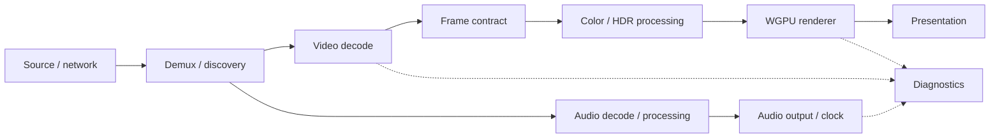

<p align="center">
  
</p>

# Rustiplayer

A Rust-first desktop media player built for hardware-accelerated playback, responsive controls, and efficient use of real hardware.

[](https://github.com/Bogdan7c/rustiplayer/actions/workflows/ci.yml)
[](https://github.com/Bogdan7c/rustiplayer/actions/workflows/toolchain-policy.yml)
[](LICENSE)

**Active development · Pre-alpha · Linux-first.** Built and maintained by one core maintainer. Expect rough edges and source builds while the project works toward 1.0.

> **Runtime screenshot — pending S08.** A real playback capture from a ThinkPad T480s will appear here. See the [T480s evidence checklist](docs/benchmarks/thinkpad-t480s.md).

<!-- S08: replace this placeholder with the real T480s runtime screenshot at
     docs/assets/rustiplayer-t480s-main.png only after playback is verified.
     Never fill this slot with docs/design/general.png or another design concept. -->

## Why Rustiplayer exists

Playing media well means coordinating untrusted inputs, decoders, GPU resources, audio clocks, and user interaction without making the application hard to maintain.

- **Performance by design.** VA-API hardware decoding and WGPU/Vulkan rendering keep supported video work on the GPU. Compatible DMA-BUF frames can reach the renderer without a CPU pixel copy; software-decoded frames still use GPU color conversion.
- **A lighter native playback path.** The desktop UI uses egui/winit, with bounded workers and resource budgets. Supported direct network sources avoid an extractor subprocess. Low overhead is a design priority; whole-application memory and power claims await the T480s baseline.
- **Design and everyday UX matter.** Playback controls, an interactive seek timeline, playlist navigation, and settings live in the native application. A cohesive UI redesign is still on the roadmap; [design concepts](docs/design/README.md) are clearly labeled as concepts.
- **Change settings while the application is running.** Settings have explicit runtime owners, live previews where supported, and transactional Apply/rollback. Changes that need a decoder, source, audio output, or renderer rebuild use controlled reconfiguration; busy playback operations can require an explicit retry.
- **Real hardware is the target.** Efficient playback on low-power laptops matters alongside correctness. Existing hardware evidence and the planned T480s measurements are kept separate from synthetic tests.
- **A safer, modular Rust orchestration layer.** Source, decode, frame lifetime, rendering, and session control have explicit contracts. Untrusted media and network manifests are a serious attack surface: Rust helps manage ownership, while native libraries, drivers, and unsafe/FFI boundaries still need careful review.

## Verified capabilities

- Local media playback through Rust demux adapters, VA-API hardware decode or FFmpeg software decode, and WGPU rendering, within the supported codec/frame profiles.
- GPU HDR → SDR tone mapping, including verified AV1 10-bit P010 → BT.2446-C → SDR BT.709. This is **not native HDR display output**.
- Native progressive HTTP(S)/FTP(S), HLS VOD/live/DVR, DASH VOD/live/DVR, and supported static Smooth Streaming and HDS profiles. Web pages can use the optional system `yt-dlp` adapter.
- Audio playback, seeking, stream selection, and source reopen/recovery within the accepted media profiles.
- M3U/M3U8, XSPF, and CUE playlist import/export, queue persistence, and playback-position restore.
- Runtime settings application and playback/render diagnostics for investigating actual behavior.

[N15 acceptance](docs/native-web-ingress-n15-acceptance.md) records 11 successful source rows reaching the startup presentation/audio gate, two explicit profile exclusions, and real hardware checks. The [compatibility matrix](docs/web-media-compatibility-matrix.md) defines the narrower container, codec, and protocol contracts; a protocol name alone does not promise every variant.

## Architecture at a glance



Color/HDR processing runs inside the GPU rendering path; the diagram separates its responsibility, not an extra CPU conversion step. The application composes these parts while `player-core` owns playback scheduling and lifecycle. Read [ARCHITECTURE.md](ARCHITECTURE.md) for ownership, resource release, settings transactions, and test boundaries.

## Current platform and support matrix

| Area | Current status | Evidence / boundary |
| --- | --- | --- |
| Linux x86_64 | Primary development and runtime target; Vulkan required | [Build and CI policy](docs/continuous-integration.md) |
| Linux VA-API | Implemented; support depends on GPU, driver, codec/profile, and renderer import compatibility | [N15 hardware acceptance](docs/native-web-ingress-n15-acceptance.md#auto-и-hardware): Radeon 780M / Mesa 26.2.1; representative AV1 and VP9 evidence |
| FFmpeg software decoding | Enabled in the default build; rendering still requires the GPU | [Frame and backend boundaries](ARCHITECTURE.md#video-frames-and-gpu-ownership) |
| HDR → SDR | Verified on the existing SDR output path | [N15 evidence](docs/native-web-ingress-n15-acceptance.md#auto-и-hardware) |
| Native HDR display output | Not implemented; real HDR display acceptance not run | No HDR-monitor claim |
| ThinkPad T480s | Runtime screenshot and performance qualification pending S08 | [Pending report](docs/benchmarks/thinkpad-t480s.md) |
| Windows | Native application support is planned before 1.0; not currently supported | Roadmap item 8 |
| macOS | Not supported; outside the roadmap through 1.0 | No delivery commitment |

## Performance: measured scope first

The existing **N15 native-versus-legacy ingress experiment** measured fixture-based source opening, with 30 successful repetitions per cohort and nearest-rank p95. It compares the legacy extractor fixture with native Ogg ingress. These are not whole-player startup, steady-state video, battery-life, or VLC measurements.

| Matched cold metric | Legacy median / p95 | Native median / p95 |
| --- | ---: | ---: |
| Catalog preparation | 29.486 / 30.569 ms | 4.321 / 4.403 ms |
| First consumer | 29.757 / 30.859 ms | 5.324 / 5.559 ms |
| Experiment wall time | 73.079 / 74.236 ms | 19.737 / 20.125 ms |
| Maximum RSS | 51,320 / 51,712 KiB | 47,774 / 48,068 KiB |

In this experiment, median catalog latency fell **85.35%** and median first-consumer latency fell **82.11%**. These results support the narrower benefit of avoiding extractor work on native sources. Payload-byte counters differ between paths and are not a throughput comparison.

The [benchmark policy and methodology guide](docs/benchmarks/README.md#existing-n15-ingress-experiment) links the full [N15 methodology and acceptance report](docs/native-web-ingress-n15-acceptance.md#performance-30-cold--30-warm) and [machine-readable aggregates](docs/native-web-ingress-n15-performance.json), including warm cohorts and limitations. Original per-run samples are not in the public tree.

**VLC comparison:** no comparable VLC results have been published here. The separate [T480s baseline](docs/benchmarks/thinkpad-t480s.md) remains pending; a comparison may be added only if the playback paths and measurement conditions can be made equivalent.

## Current limitations

- Pre-alpha software: Linux-first source builds, incomplete platform coverage, and a UI still undergoing redesign. The current interface contains Russian text; localization is planned.
- Hardware acceleration is capability-dependent. The existence of a codec backend or a Vulkan device does not prove a particular file will play through hardware decode.
- Native HDR output and CPU readback fallback are not implemented. A working Vulkan renderer is required even for software video decode.
- Subtitle descriptors in manifests do not imply subtitle playback. A native subtitle engine and a published compatibility matrix remain roadmap work.
- DRM, RTSP/RTP/MMS, RTMP wire playback, and private live extractor state are outside the supported profile. Smooth Streaming and HDS are static VOD only.
- Some exact profiles are rejected intentionally: N15 excludes its avc3/HE-AAC/TTML HLS row and a DASH row whose aspect metadata cannot be represented correctly by the current display contract.
- Web-page extraction depends on a compatible system `yt-dlp`, its extractors, server availability, and accepted media profiles. User configuration, plugins, and cookies are a trusted external environment; FFmpeg is not a hidden network/demux fallback.
- The N15 cross-source queue regression proves media consumers before queue commit; it does not prove every windowed UI Next transition. See [acceptance limitations](docs/native-web-ingress-n15-acceptance.md#known-limitations).

## Quick start

Build prerequisites: Linux x86_64, a Vulkan-capable GPU/driver, Rust **1.96.0** from [rust-toolchain.toml](rust-toolchain.toml), a C/C++ toolchain, `clang`/`libclang`, `pkg-config`, and development headers for ALSA, FFmpeg, GBM/DRM, and VA-API. The locked MSRV check uses Rust **1.92.0**.

Ubuntu 24.04 package names, aligned with the repository's CI prerequisites:

```bash
sudo apt-get update
sudo apt-get install build-essential clang libclang-dev pkg-config \
  libasound2-dev libavcodec-dev libavutil-dev libdrm-dev libgbm-dev libva-dev \
  libvulkan1 mesa-vulkan-drivers

git clone https://github.com/Bogdan7c/rustiplayer.git
cd rustiplayer
cargo build -p app-egui --release --locked
./target/release/rustiplayer /path/to/media.mp4
```

Install Rust through rustup before building; the repository pins the toolchain. Mesa packages above do not replace the correct VA-API driver for your GPU. Supply your own local media file and run in a graphical desktop session with access to the render device and audio output.

For web-page extraction, install system `yt-dlp` separately. The repository's accepted extractor profile uses **2026.07.04**; other versions are not automatically acceptance-qualified. Supported native direct sources do not require it. See the [web-media matrix](docs/web-media-compatibility-matrix.md).

The default application feature includes FFmpeg software decoding. The build boundary without it is checked with:

```bash
cargo check -p app-egui --no-default-features --locked
```

## Testing and quality

The repository has workspace tests, strict Clippy/rustdoc, formatting and architectural guardrails, locked toolchain/MSRV checks, dependency policy, and a stable-coverage ratchet. Functional media tests reach WGPU submission/readback or nonzero PCM; real display, VA-API import, and audio-device acceptance remain separate.

```bash
cargo test --workspace --all-features --locked
scripts/pre-pr-checks.sh
```

Full tests also need the [CI test prerequisites and tool versions](docs/continuous-integration.md), including `libsoundtouch-dev` and a headless Vulkan adapter where no GPU is available. The pre-PR wrapper runs the repository checks; coverage has its own command and qualification policy.

Read [CI](docs/continuous-integration.md), [coverage](docs/code-coverage.md), [manual media regressions](docs/manual-media-regressions.md), and [runtime acceptance](docs/runtime-acceptance-manifest.md). The [documentation index](docs/README.md) marks English and Russian documents explicitly. AI tooling is optional and is not required to build or contribute.

## Roadmap to 1.0

The implementation order is fixed; these are planned milestones, not current capabilities:

1. Build a native Rust subtitle engine with a broad, published text/styled/bitmap format compatibility matrix.
2. Add a browser media-handoff bridge and browser extension.
3. Complete the cohesive application redesign, including replacement of the prototype settings UI.
4. Make application colors and appearance fully configurable from settings.
5. Add localization infrastructure and initial translations.
6. Add an OpenGL ES 2.0 renderer for older Linux hardware.
7. Add drag-and-drop for local files and URLs.
8. Complete native Windows application support.

macOS is outside the roadmap through 1.0.

## Contributing

Start with the [architecture](ARCHITECTURE.md), [engineering docs](docs/README.md), and [contributor/agent rules](AGENTS.md). Focused reproductions, testable fixes, and documentation improvements are useful contributions. The dedicated `CONTRIBUTING.md` and support guide are pending S07; [AI-assisted development](docs/ai-development.md) explains the optional maintainer workflow.

## Security

Treat media, network manifests, native decoding, GPU imports, and upstream FFI as security-sensitive boundaries. See the [trust-boundary overview](ARCHITECTURE.md#trust-boundaries) and [dependency policy](docs/continuous-integration.md). Do not put credentials, private media URLs, or exploit details in public issues. `SECURITY.md` is pending S07; GitHub Private Vulnerability Reporting is planned for the public launch and is not claimed to be enabled yet.

## Maintainer and license

**Bogdan Korolyov ([Bogdan7c](https://github.com/Bogdan7c))** is the sole core maintainer. The dedicated `MAINTAINERS.md` is pending S07.

First-party workspace code is [MIT licensed](LICENSE). The seven [patched upstream crates](docs/dependency-patches.toml) retain their own licenses and notices: BSD-3-Clause for cros-codecs/cros-libva, MPL-2.0 for the four Symphonia patches, and MIT for wayland-scanner.
