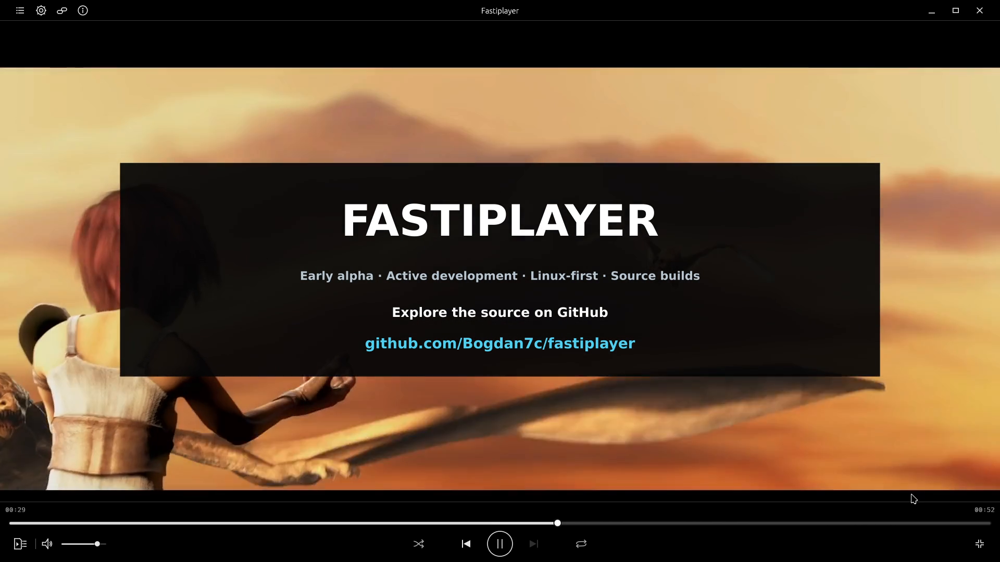

# See Fastiplayer in action

**Early alpha · Active development · Linux-first · Source builds**

**[Watch on YouTube — 72 seconds, 1080p60, with sound](https://www.youtube.com/watch?v=eMfzBhpSF8M)** · [Build and run](../README.md#quick-start)

This is the real application on the current development computer, recorded in OBS Studio and edited in DaVinci Resolve. Each feature is shown in a continuous segment at its captured speed. English titles sit clear of the timeline and color controls. The interface still includes Russian text; its settings design and localization remain roadmap work.

## What the trailer shows

| Time | Interaction and result |
| --- | --- |
| [00:00–00:05](https://www.youtube.com/watch?v=eMfzBhpSF8M&t=0s) | Playback in your hands: film playback and movement of the queue panel. |
| [00:05–00:23](https://www.youtube.com/watch?v=eMfzBhpSF8M&t=5s) | Playback speed rises from 1.0× to 1.5× and returns to 1.0× with the player's original audio output. Pause keeps the picture; resume continues without a start instruction over the film. |
| [00:23–00:39](https://www.youtube.com/watch?v=eMfzBhpSF8M&t=23s) | Live timeline scrubbing: a continuous forward, backward, and forward drag changes the main picture; release resumes playback. |
| [00:39–00:57](https://www.youtube.com/watch?v=eMfzBhpSF8M&t=39s) | Real-time video color: reduce saturation to monochrome, increase it, reset, change contrast, and reset again while the film keeps playing. |
| [00:57–01:07](https://www.youtube.com/watch?v=eMfzBhpSF8M&t=57s) | Queue and settings panels open and close; playback controls animate as their state changes. |
| [01:07–01:12](https://www.youtube.com/watch?v=eMfzBhpSF8M&t=67s) | Fastiplayer, the current alpha status, and an invitation to explore the source on GitHub. |

Speed control changes tempo through pitch-preserving time stretching. It is distinct from timeline dragging: ordinary playback audio pauses during a drag and resumes after release. The trailer does not claim reverse-audio scrubbing or a separate pitch-shift control. Live timeline scrubbing is already implemented; drag-and-drop for files and URLs remains future work.

Video color controls adjust the film image. Fuller customization of the application's colors and appearance is a separate roadmap item. The color episode has no editorial color correction applied to the captured player image.

## Playback

Local H.264 video with AAC source audio, using VA-API hardware decoding and WGPU/Vulkan rendering. This frame follows the live timeline drag and shows resumed playback. The source film runs at 24 FPS; OBS captures the application at 60 FPS.

## Queue

The queue shares the window with playback. Only the public film name is visible; no local path appears. The trailer shows the panel opening and closing. Playlist import/export and persistence are working capabilities described in the [README](../README.md#what-works-today), but are not exercised in this short trailer.

## Settings

The screenshot shows an intentionally strong saturation adjustment and its live effect. The trailer also shows monochrome, increased contrast, and restoration of the original values. Runtime settings still use the existing unfinished interface; this demonstration does not imply that the planned settings redesign is complete.

## Sound and capture

The only soundtrack is the actual player output from the licensed film. No background music, narration, microphone, or artificial interface sounds were added. Silence during dragging and the demonstrated pause reflects application behavior.

OBS captured the isolated player window at **1920×1080, 60 FPS**, with **PCM 24-bit / 48 kHz stereo**. Resolve assembled six video segments with their corresponding original audio, native English titles, and a short audio fade at the end. The recording was not sped up, interpolated, or color-graded to imitate application behavior. This is a product demonstration, not a latency, frame-delivery, or resource benchmark, and is separate from the historical ThinkPad T480s measurements.

Film and audio: **Sintel © copyright Blender Foundation | durian.blender.org**, licensed under [CC BY 3.0](https://creativecommons.org/licenses/by/3.0/). Excerpts shown inside Fastiplayer; edited screen capture with English titles. [Full attribution, source revision, capture parameters, and checksums](assets/README.md).
