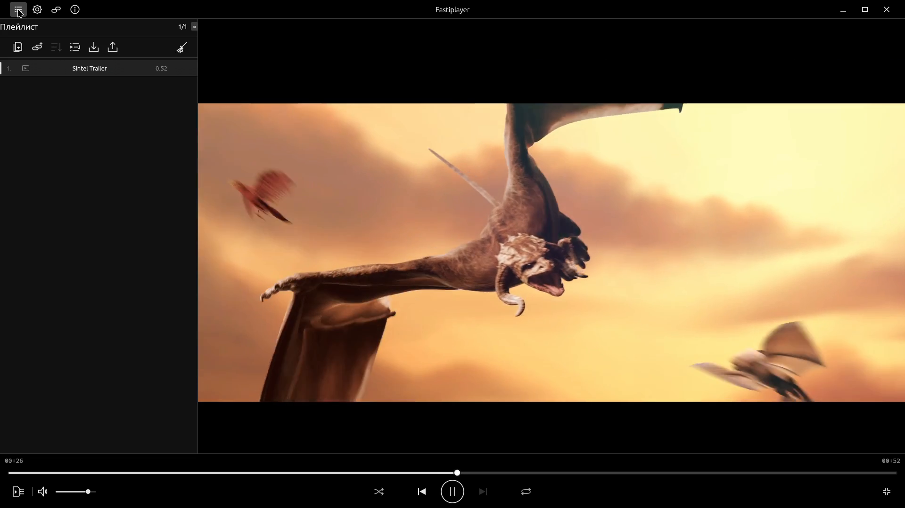
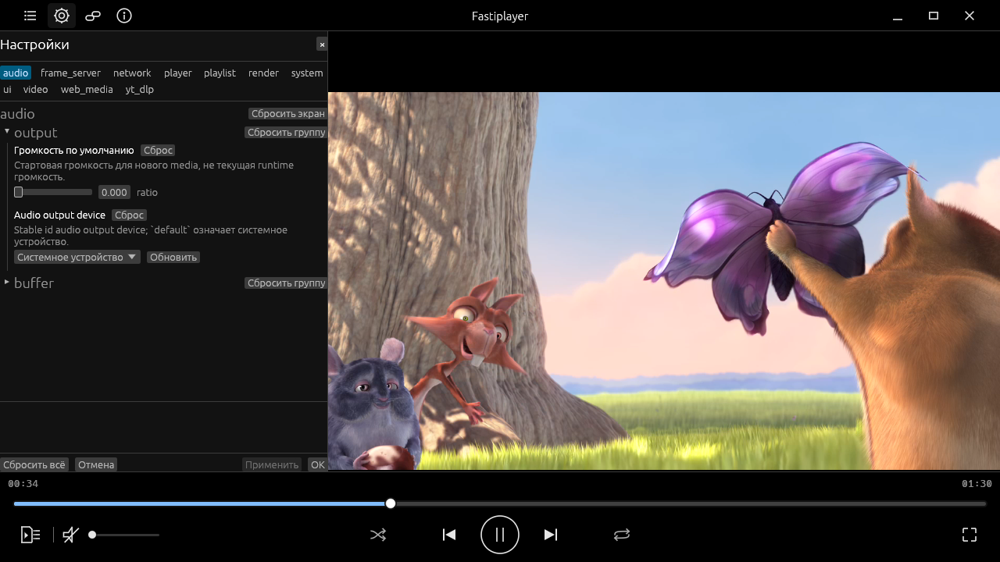

# See Fastiplayer in action

**Early alpha · Active development · Linux-first · Source builds**

[Download the 39-second demo (MP4, 5.3 MB)](https://github.com/Bogdan7c/fastiplayer/raw/refs/heads/main/docs/assets/fastiplayer-demo.mp4) · [Build and run](../README.md#quick-start)

Download the MP4 and open it in your player. GitHub does not provide an inline preview for this file.

This is the real application running on the current development computer. The video has English captions below the captured window. Its interface still includes Russian text; the settings design and localization remain roadmap work.

## Playback

Local H.264 video with AAC audio, using FFmpeg software decoding and the WGPU/Vulkan renderer. Pause preserves the picture; resume continues playback without a start instruction over the film.

## Queue

The queue shares the window with playback. These two authorized local excerpts demonstrate the existing queue interface; their names are the only media locators visible in the captures.

## Settings

Settings open in the same sidebar as the queue. Runtime Apply/rollback and live previews are available where supported; the demo shows opening the settings panel. It does not demonstrate a settings change or imply that the planned settings redesign is complete.

## Video transcript

| Time | Action / caption |
| --- | --- |
| 00:00–00:05 | Open a local file. The system picker is outside the captured player window. |
| 00:05–00:11 | Play local media. |
| 00:11–00:14 | Pause and keep the picture. |
| 00:14–00:19 | Resume playback. |
| 00:19–00:23 | Seek with the timeline. |
| 00:23–00:29 | Explore the persistent queue. |
| 00:29–00:35 | Open runtime settings; the interface is still evolving. |
| 00:35–00:39 | Fastiplayer — early alpha, Linux-first, source builds. |

The recording is silent; the player's audio pipeline was active at zero gain. The captured window runs at 1280×720, with an added caption band in the MP4. This is a product demonstration, not a frame-rate, latency, or resource benchmark.

Movie imagery: **Big Buck Bunny**, © 2008 Blender Foundation / www.bigbuckbunny.org, licensed under [CC BY 3.0](https://creativecommons.org/licenses/by/3.0/). The film was excerpted and remuxed for playback; the screen recording adds the player interface and English captions. [Full attribution, environment, source revision, and checksums](assets/README.md).
